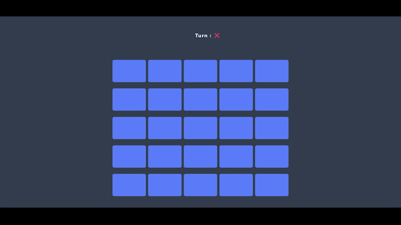

# Min-Dos 🎮

---

## English

**Min-Dos** is a simple web-based project inspired by classic operating systems like MS-DOS.  
You can type commands and interact with a basic simulated environment!

🔹 Technologies used: HTML, CSS, JavaScript  
🔹 Features: Simple command-line interface, basic commands, retro feel.

---

## فارسی 🇮🇷

**Min-Dos** یک پروژه‌ی ساده‌ی تحت وب است که از سیستم عامل‌های قدیمی مانند MS-DOS الهام گرفته شده.  
شما می‌توانید دستورات مختلفی وارد کرده و با یک محیط شبیه‌سازی شده تعامل داشته باشید!

🔹 تکنولوژی‌های استفاده شده: HTML، CSS، JavaScript  
🔹 ویژگی‌ها: محیط خط فرمان ساده، دستورات پایه‌ای، حس نوستالژیک.
